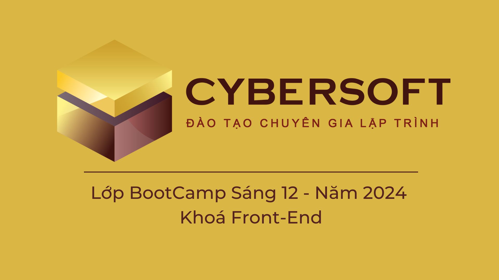

# CYBERSOFT ACADEMY

_(Lớp BootCamp Sáng 12 - Năm 2024 - Khoá Front-End)_

	<picture>
		
	</picture>

## [Buổi 22 - 23] THỰC HÀNH SASS - [CyberPhone](https://layout-cyber-phone.vercel.app/)

# Mục tiêu

1. Tìm hiểu về SASS.

2. Thực hành SASS với bài tập CyberPhone.

3. Có thể phát triển thành layout [CyberPhone](https://cyber-phone-dark.vercel.app/)

> Bài làm của Trương Thục Vân.
